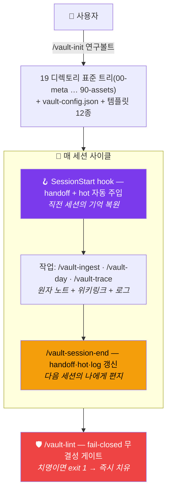
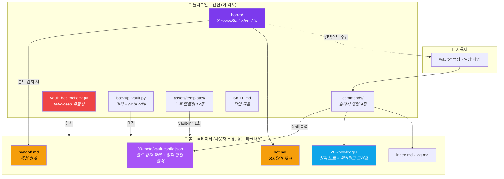
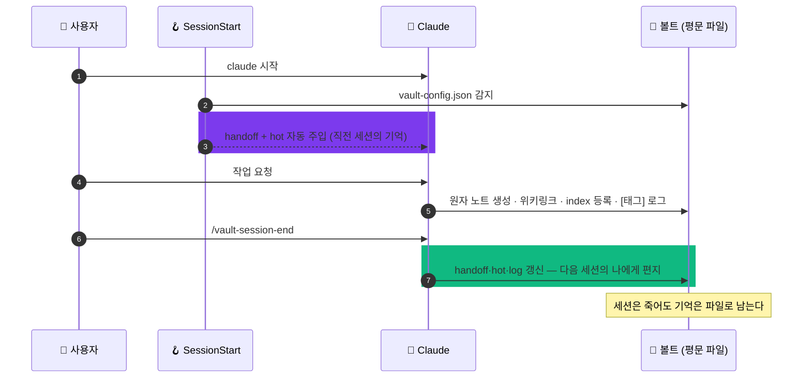
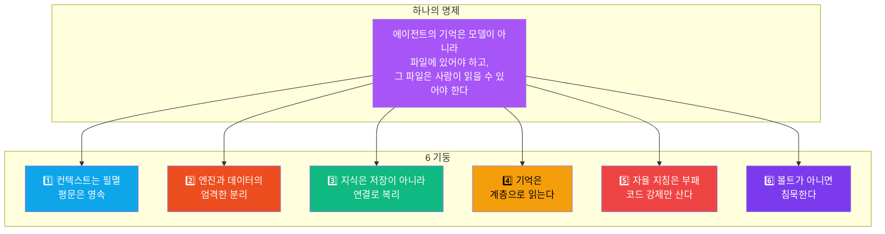

<div align="center">

# agentic-vault

### 옵시디언 볼트 = Claude Code의 영구 기억 — 파일 기반 에이전틱 메모리

**세션은 죽는다. 기억은 파일로 산다.**<br/>
컨텍스트 윈도우를 늘리는 대신 **기억을 사람이 읽을 수 있는 평문 마크다운에 내려놓는다**.

<br/>

[](https://github.com/Technoetic/agentic-vault)
[](https://github.com/Technoetic/agentic-vault/releases/tag/v0.3.1)
[](LICENSE)
[](#-설치)
[](#%EF%B8%8F-한계-정직성)

[](commands/)
[](assets/templates/)
[](hooks/hooks.json)
[](skills/agentic-vault/scripts/vault_healthcheck.py)
[](#-6개-핵심-철학)

<br/>



</div>

---

<div align="center">

## ⚡ 30초 안에 이해하기

</div>



> [!IMPORTANT]
> 기억의 원천은 모델도, 벡터 DB도 아니다 — **사람이 읽을 수 있는 마크다운 파일**이다.<br/>
> 플러그인을 지워도 볼트는 온전한 옵시디언 볼트로 남는다.

<details>
<summary><b>🌐 English summary</b></summary>

*agentic-vault* turns a plain-Markdown Obsidian vault into a persistent, file-based memory layer for Claude Code. It combines four ideas: **file-based agentic memory** (plain text as ground truth), an **LLM Wiki** (wikilink graph traversal), **tiered memory** (a 500-word hot context, a session handoff cache, and grep/index paging over the full vault), and **Zettelkasten discipline** (atomic notes, dense linking). Ships 8 slash commands, a SessionStart hook that auto-injects the previous session's handoff, a stdlib-only fail-closed health checker, git pre-commit/pre-push guards (frontmatter & YAML-wikilink validation at commit time, local-only push blocking), a handoff commit anchor for deterministic session diffs, a cross-platform backup script, and 12 note templates. All vault policy lives in a single `00-meta/vault-config.json`; directories without that file are silently ignored. Engine and data are strictly separated — the plugin is generic, your vault is yours.

</details>

---

<div align="center">

## 🎯 무엇을 해주는가

</div>

| 입력 | 산출 |
|:---|:---|
| `/vault-init 연구볼트` | 표준 트리 19 디렉토리 + `vault-config.json` + 시스템 노트·템플릿 + CLAUDE.md 행동 계약 |
| `/vault-session-start` | handoff → hot → index 순서로 직전 상태 복원 + 4항목 브리핑 |
| `/vault-ingest 보고서.md` | 소스 1건 → 원자 노트 분해 + 위키링크 + 기존 노트 갱신 + index 등록 + `[ingest]` 로그 |
| `/vault-process-inbox` | `10-inbox/` 대기열 정제 → 영구 지식 병합 → 원본 `_processed/` 격리 |
| `/vault-day 오늘 미팅 요약…` | `30-journal/YYYY/MM/` 데일리 노트에 위키링크와 함께 기록 |
| `/vault-trace 키워드` | 저널·미팅·지식·결정 노트 횡단 시계열 추적 → 진화·모순·다음 행동 내러티브 |
| `/vault-lint` | fail-closed 무결성 검사 → 치명 즉시 치유, 관리성은 사용자 확인 후 처리 |
| `/vault-session-end` | handoff·hot·log 갱신 + **기준 커밋(anchor) 고정** + git 커밋(로컬) + 백업 권고 — **다음 세션 예약** |
| `/vault-jarvis-setup` | 🤖 Telegram 자비스 활성화 — 아침 브리핑·원격 캡처·읽기전용 Q&A·집사 보고 |

---

<div align="center">

## 🏗️ 아키텍처 — 엔진과 데이터의 분리

</div>



볼트의 모든 정책(deny zone·필수 프런트매터 키·Enum·로그 태그·SSOT 사실)은 볼트 쪽 `vault-config.json` **한 파일**로 선언된다.
`00-meta/vault-config.json`이 없는 디렉토리에서 모든 컴포넌트는 **조용히 무동작**한다 — 훅도, 검사기도, 명령도.

---

<div align="center">

## 🧠 계층형 메모리 — 전부 읽으면 터지고, 안 읽으면 기억상실

</div>


OS 메모리 계층처럼 읽는다: **자주 쓰는 것일수록 위층, 필요한 만큼만, 위층부터.**
SessionStart 훅이 위 두 계층(handoff+hot)을 자동 주입하므로 대부분의 세션은 시작 즉시 직전 상태를 이어받는다.

선택적으로 **장기 기억 MCP**(예: [memoryhub.ai](https://memoryhub.ai))를 세션 횡단 회상 계층으로 연결할 수 있다 — 단 역할 경계는 엄격하다: **볼트 = 진실의 원천(사람이 읽는 구조화 지식), 장기 기억 MCP = 기계 회상(세션 횡단 교훈·결정 원칙)**. 회상이 볼트와 모순되면 볼트가 우선한다.



---

<div align="center">

## 🧱 6개 핵심 철학

</div>



| # | 철학 | 한 줄 |
|:---:|:---|:---|
| 1 | **컨텍스트는 필멸, 평문은 영속** | handoff는 "다음 세션의 나에게 쓰는 편지". 10년 뒤에도 열리는 매체에 기억을 둔다 |
| 2 | **엔진 ≠ 데이터** | 플러그인은 지식을 한 글자도 담지 않는다. 정책은 볼트의 `vault-config.json` 한 파일 |
| 3 | **연결이 복리를 만든다** | 원자 노트 + 밀집 위키링크. **고아 링크는 오류가 아니라 미래 노트의 예약** |
| 4 | **계층으로 읽는다** | hot 500단어(캐시) → handoff(인계) → index(지도) → grep(페이징) |
| 5 | **자율 지침은 부패한다** | 스키마·태그·링크 무결성은 산문 규칙이 아니라 fail-closed 검사기로 강제. 증거는 서술이 아니라 exit code |
| 6 | **볼트가 아니면 침묵** | config 없는 디렉토리에선 전 컴포넌트 무동작. 설정 키를 비우면 그 기능만 꺼진다(우아한 성능 저하) |

이 플러그인은 새로운 발명이 아니라 **오래된 세 전통의 합류점**이다 — 제텔카스텐(1960년대 지식 관리), 유닉스 철학(평문·작은 도구·침묵), 에이전틱 메모리(2020년대 AI). 새것은 조합뿐이고, 그래서 오래간다.

---

<div align="center">

## 📦 무엇이 들어 있나

</div>

```
agentic-vault/
├── .claude-plugin/                    ← plugin.json · marketplace.json (v0.3.1 · MIT)
│
├── commands/                          ← 9개 슬래시 커맨드
│   ├── vault-init.md                  ← 볼트 스캐폴딩 (1회)
│   ├── vault-session-start.md         ← 세션 복원 — handoff→hot→index 브리핑
│   ├── vault-session-end.md           ← 세션 마감 — 인계 갱신 + git 커밋  🔥
│   ├── vault-day.md                   ← 데일리 저널
│   ├── vault-ingest.md                ← 소스 → 원자 노트 소화 (LLM Wiki 패턴)
│   ├── vault-process-inbox.md         ← 인박스 정제 + _processed 격리
│   ├── vault-lint.md                  ← 무결성 검증 + 자가 치유  🛡️
│   ├── vault-trace.md                 ← 키워드 시계열 횡단 추적
│   └── vault-jarvis-setup.md          ← Telegram 자비스 설정  🤖
│
├── hooks/
│   ├── hooks.json                     ← SessionStart 바인딩 (주입 + 비동기 검사)
│   └── session_start.py               ← handoff·hot 자동 주입  🔥
│
├── skills/agentic-vault/
│   ├── SKILL.md                       ← 작업 규율 (중복 grep → 스키마 → 링크 → 기록)
│   ├── references/
│   │   ├── linking-rules.md           ← 위키링크 규율 (고아 링크 철학 포함)
│   │   └── memory-tiers.md            ← 계층형 메모리 + SSOT 룩업 설계
│   └── scripts/
│       ├── vault_healthcheck.py       ← fail-closed 무결성 검사기  🛡️
│       ├── backup_vault.py            ← robocopy/rsync/shutil + git bundle
│       └── jarvis_bridge.py           ← Telegram 자비스 브리지 (stdlib-only 상시 데몬)  🤖
│
├── assets/templates/                  ← 12개 노트·시스템 템플릿
│   ├── vault-config.json              ← 볼트 정책 단일 출처
│   ├── hot.md · handoff.md · index.md · log.md
│   ├── context.md · tasks.md · decisions.md · mistakes.md
│   ├── frontmatter-schema.md · CLAUDE-vault-section.md
│   └── settings-permissions.json      ← deny zone Read 차단 블록
│
└── assets/git-hooks/                  ← git 무결성 게이트 (vault-init이 볼트에 설치)  🛡️
    ├── pre-commit                     ← 커밋 시점 fail-closed 검증 (프런트매터·YAML 위키링크)
    └── pre-push                       ← 원격 push 차단 (로컬 전용 기계 강제)
```

---

<div align="center">

## 🚀 설치

</div>

### 방법 1 — Claude에게 자연어로 부탁 (가장 자연스러움)

Claude Code 터미널에서 평소처럼 말 걸면 됩니다:

```text
agentic-vault 플러그인을 깔아줘. Technoetic/agentic-vault 레포에 있어.
```

Claude가 다음 2단계를 안내합니다 (사용자가 직접 입력):

```text
/plugin marketplace add Technoetic/agentic-vault
/plugin install agentic-vault@agentic-vault
```

> [!IMPORTANT]
> `/plugin` 슬래시 명령은 **사용자가 직접 입력**해야 적용됩니다. Claude가 Bash 도구로 대신 실행할 수 없습니다 (보안 제약). 설치 후 Claude Code를 재시작해야 훅·명령이 로드됩니다.

### 방법 2 — 슬래시 명령 직접 입력

```text
/plugin marketplace add Technoetic/agentic-vault
/plugin install agentic-vault@agentic-vault
```

### 방법 3 — 로컬 클론 (개발 / 커스터마이즈)

```text
git clone https://github.com/Technoetic/agentic-vault D:\agentic-vault-plugin

/plugin marketplace add D:\agentic-vault-plugin
/plugin install agentic-vault@agentic-vault
```

### 요구사항

Python 3.10+ (표준 라이브러리만 사용 — pip 설치 0개). 옵시디언은 선택이지만 강력 추천 — 그래프 뷰가 지식 네트워크를 보여준다.

---

<div align="center">

## 📡 사용

</div>

### 볼트 만들기 (1회)

```text
cd my-vault            # 볼트로 쓸 디렉토리 (기존 옵시디언 볼트도 가능)
claude
/vault-init 연구볼트
```

### 매 세션 사이클

```text
/vault-session-start   # 직전 상태 복원 (훅이 이미 주입했으면 브리핑만)
... 작업 ...            # /vault-ingest · /vault-day · /vault-trace
/vault-session-end     # 다음 세션 예약 — handoff·hot·log 갱신 + git 커밋
```

### 장기 기억 MCP 연동 (선택)

장기 기억 MCP 서버가 세션에 연결되어 있으면 두 명령이 자동으로 활용한다 — 미연결이면 조용히 생략(우아한 성능 저하):

- **`/vault-session-start`** — 시작 시 1회 회상(recall)로 세션 횡단 맥락을 로드. **회상이 볼트와 모순되면 볼트 우선.**
- **`/vault-session-end`** — 세션을 횡단해 유효한 교훈·결정 원칙만 **신뢰도 기반으로 선별 커밋**(remember). 일회성 세부사항·handoff와 겹치는 만료성 상태는 제외.

예: [memoryhub.ai](https://memoryhub.ai) — 원 볼트(이 플러그인의 모체)가 실전 검증한 구성. SDK 기반 SaaS라 공식 MCP 서버가 없어 자체 stdio 브리지로 연동했다. 같은 사실을 볼트와 MCP 양쪽에 중복 저장하지 않는 것이 경계 규칙이다.

### 볼트 정책 선언 — vault-config.json

<details>
<summary><b>📋 19개 설정 키 전체 — 클릭하여 펼치기</b></summary>

| 키 | 설명 |
|:---|:---|
| `vault_name` | 볼트 표시 이름 |
| `language` | 볼트 주 언어 (`ko`, `en` 등) — 생성 노트·브리핑 언어 |
| `deny_zones` | 읽기·스캔 절대 금지 경로 목록 (격리·아카이브·바이너리 구역) |
| `exclude_dirs` | 스캔 제외 디렉토리 (node_modules, .git 등 — 금지 구역은 아님) |
| `required_keys` | 모든 노트 프런트매터의 필수 키 목록 |
| `enums` | `type`·`status`·`ai_priority`의 허용 값 — 임의 값 발명 차단 |
| `frontmatter_max_lines` | 프런트매터 최대 줄 수 예산 |
| `index_note` | 볼트 전체 지도 노트 경로 (노트 목록의 단일 원천) |
| `log_note` | 작업 로그 노트 경로 (최상단 append, 1줄/작업) |
| `log_tags` | 로그 연산 태그 허용 목록 — 로그를 grep 가능한 데이터로 |
| `log_tag_epoch` | 로그 태그 강제 시작일 — 이후 항목만 검사 (과거 소급 금지) |
| `hot_note` | 핫 컨텍스트 노트 경로 (500단어 현재 상태 스냅숏) |
| `handoff_note` | 세션 인계 노트 경로 — **빈 문자열이면 인계 기능 생략** |
| `ssot_note` | 핵심 사실 SSOT 노트 경로 — **빈 문자열이면 SSOT 기능 생략** |
| `ssot_facts` | `[{"label", "pattern"}]` — 볼트 전체에서 매치 값 2종 이상이면 모순 보고 |
| `health_report` | 헬스체크 리포트 출력 경로 |
| `backup_target` | 백업 대상 경로 — **빈 문자열이면 백업 생략** |
| `stale_days` | (선택 확장) 노화 문서 검사 임계 일수 — 미설정/0이면 생략 |
| `index_scopes` | (선택 확장) 인덱스 미등록 검사 대상 최상위 폴더 — 미설정 시 기본 스코프 |

`handoff_note`·`ssot_note`·`backup_target`을 비워두면 해당 기능만 조용히 꺼진다(우아한 성능 저하) — 최소 구성으로 시작해 필요할 때 켜면 된다.

</details>

---

<div align="center">

## 🤖 Jarvis 계층 — 먼저 말 걸고, 받아적고, 물으면 답하는 (선택)

</div>

`/vault-jarvis-setup`으로 Telegram 봇을 연결하면 볼트가 개인 비서가 된다 — 몸통은 최소(브리지 1개·채널 1개), 두뇌(기억·지식)는 볼트 4축이 담당한다.

| 능력 | 동작 | LLM |
|:---|:---|:---:|
| 🌅 아침 브리핑 | 매일 지정 시각, hot·handoff·log·git 활동을 종합해 푸시 (`/brief`로 즉석 호출) | 읽기전용 |
| 📝 원격 캡처 | `기억해: ...` → `10-inbox/jarvis/`에 저장, `/vault-process-inbox`로 정제 | **무관여** |
| 💬 볼트 Q&A | 자유 질문 → hot→index→grep 탐색 후 근거 노트 인용 답변 | 읽기전용 |
| 🧹 집사 보고 | 주기적으로 healthcheck·mirror push·인박스 현황 보고 (치유는 안 함) | 무관여 |

**보안 경계 (하드 룰):** 숫자 user ID 화이트리스트 외 발신자는 무응답 폐기 · Q&A 세션 도구는 `Read Grep Glob`뿐(쓰기·Bash 영구 불허) · 자비스의 볼트 쓰기는 인박스 한 곳 · deny zone과 `.env`는 탐색 금지 · 봇 토큰은 env `JARVIS_TELEGRAM_TOKEN`(볼트 밖). `jarvis` 블록이 없거나 `enabled: false`면 전 기능 침묵.

절충의 이유: 채널 20종·음성 같은 몸통 인프라는 OpenClaw의 영역이라 재발명하지 않는다 — 이 계층은 "볼트를 두뇌로 쓰는 최소 자비스"다.

---

<div align="center">

## 🧪 무결성 게이트 — fail-closed

</div>

`/vault-lint`와 SessionStart 훅이 실행하는 `vault_healthcheck.py`는 신호를 무의미하게 만드는 "매번 실패"를 배제한다 — **치명만 exit 1, 관리성은 리포트만**.

| 등급 | 검사 항목 | 처리 |
|:---:|:---|:---|
| 🔴 **치명** (exit 1) | 프런트매터 붕괴 · 필수 키 누락 · Enum 위반 · **따옴표 없는 프런트매터 위키링크**(YAML 오파싱 = 메타데이터 계층 붕괴) · 로그 태그 누락·malformed 로그라인 | `/vault-lint`가 **즉시 치유** |
| 🟡 **관리성** (exit 0) | 데드링크 · 고아/준고아 노드 · 인덱스 미등록 · 프런트매터 과대 · 노화 문서(선택) · SSOT 사실 모순(선택) | 리포트 누적 → **사용자 확인 후** 스텁 생성·링크 교정·아카이브 |

> [!NOTE]
> 이 등급 설계는 실제 볼트 운영 감사에서 얻은 교훈이다: **검사기가 감시하던 영역은 전부 건강했고, 감시 밖 영역만 예외 없이 부패해 있었다.** 자율 지침은 부패한다 — 코드로 강제된 규율만 살아남는다.

무결성 강제는 세 시점에 걸린다: **세션 시작**(SessionStart 훅의 비동기 검사) → **온디맨드**(`/vault-lint` 치유) → **커밋 순간**(git pre-commit 훅). 커밋 게이트는 `/vault-init`이 git을 켤 때 `assets/git-hooks/`의 훅을 볼트의 `00-meta/scripts/git-hooks/`에 설치하고 `core.hooksPath`로 활성화한다 — 스테이징된 노트의 프런트매터 누락·따옴표 없는 YAML 위키링크를 커밋 시점에 fail-closed로 차단하고, pre-push는 네트워크 원격(https/ssh) push를 차단해 로컬 전용 정책을 기계 강제한다 — 같은 머신의 bare 미러 등 로컬 경로 원격은 허용하므로 로컬 백업 push는 막히지 않는다(우회는 `--no-verify` 명시로만). 오염이 리포지토리 이력에 들어가기 **전에** 막는 마지막 방어선이다.

또한 handoff 상단의 **기준 커밋(anchor)** 줄이 "이 handoff가 반영하는 볼트 시점"을 git 해시로 고정한다 — `/vault-session-end`가 갱신하고, `/vault-session-start`가 `anchor..HEAD` 차이를 브리핑에 반영해 handoff의 point-in-time 어긋남을 결정론적으로 해소한다. 같은 anchor 패턴이 장기 기억 MCP에도 적용된다: remember 커밋 끝에 `[anchor: <해시>]`를 붙여, 다음 세션이 낡은 회상을 볼트 이력과 대조해 걸러낸다. `/vault-trace`도 `git log -S`로 키워드의 커밋 이력을 병행 수집해, 노트가 말하는 날짜와 실제 기록된 날짜의 어긋남을 모순 신호로 잡는다.

---

<div align="center">

## ⚠️ 한계 (정직성)

</div>

| # | 한계 | 대응 |
|:---:|:---|:---|
| 1 | `/plugin` 설치·제거는 사용자 직접 입력만 가능 (Claude 대행 불가) | README 안내 텍스트 복붙 |
| 2 | SessionStart 훅 matcher는 `startup\|clear` — resume 세션엔 재주입 없음 | `/vault-session-start`를 수동 호출 |
| 3 | 파일 **위치** 규율(볼트 루트 잡파일 등)은 healthcheck 검사 밖 | CLAUDE.md 행동 계약(산문)이 커버 — 향후 버전 후보 |
| 4 | Python이 PATH에 없으면 훅·lint가 조용히 실패할 수 있음 | 요구사항 확인 (`python --version`) |
| 5 | `backup_target`이 같은 물리 디스크면 디스크 장애는 미방어 | 외장·오프사이트 대상 별도 지정 권장 |

---

<div align="center">

## 🧬 영감 / 출처

</div>

| 출처 | 무엇을 빌렸나 |
|:---|:---|
| [**Technoetic/harness107**](https://github.com/Technoetic/harness107) | **자매 레포** — harness107이 "실행"의 하네스라면 agentic-vault는 "기억"의 하네스. README 형식과 정직성 섹션 관행 공유 |
| [Karpathy — LLM Wiki gist](https://gist.github.com/karpathy/442a6bf555914893e9891c11519de94f) | 마크다운 리포를 LLM이 자가 관리하는 위키로 — index·log·ingest 사이클의 원형 |
| 제텔카스텐 (Niklas Luhmann) | 원자 노트 · 밀집 링크 · "고아 링크는 미래 노트의 예약" 철학 |
| MemGPT · A-MEM | OS 메모리 계층을 본뜬 티어드 메모리 — hot(캐시) → handoff(세션) → 볼트(디스크) |
| [Anthropic — Effective context engineering](https://www.anthropic.com/engineering) | structured note-taking(파일 기반 에이전틱 메모리) 패턴의 공식 명명 |
| [MemoryHub](https://memoryhub.ai) | 기억 3계층 경계의 실전 원형 — 볼트(진실의 원천) vs 장기 기억 MCP(세션 횡단 기계 회상)의 역할 분리와 "모순 시 볼트 우선" 원칙 |
| [Obsidian](https://obsidian.md) | 위키링크 그래프 · 프런트매터 · 로컬 평문 소유권 |

---

<div align="center">

## 📄 라이선스

[](LICENSE)

MIT License · Copyright (c) 2026 [전문준 (Technoetic)](https://github.com/Technoetic)

<br/>

**모델을 믿지 말고 파일을 믿어라.**

<br/>

[](https://github.com/Technoetic/agentic-vault)
[](https://github.com/Technoetic/agentic-vault/stargazers)

</div>
